# cabService
A cab booking app similar to OLA and UBER where a user is able to book cabs in his locality for travelling from one place to other. Also any cab/rickshaw driver may use this app to register themselves as an operator and after proper authentication they are able to pick up customers from their current location and can drive them to their desired location.

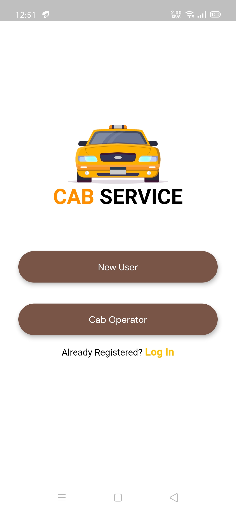         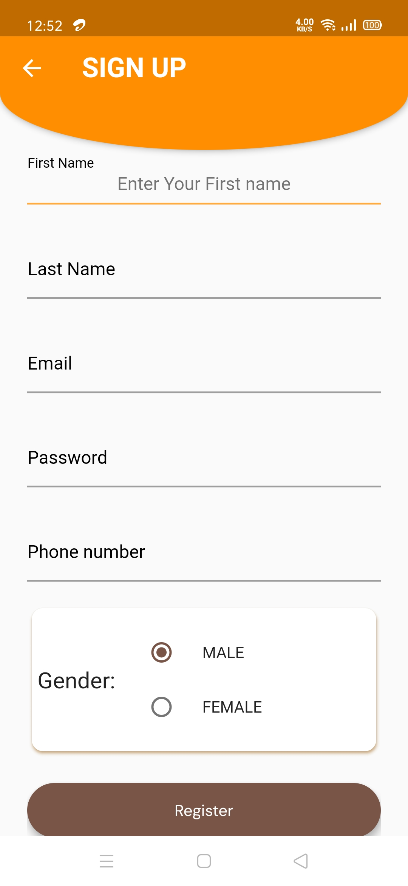          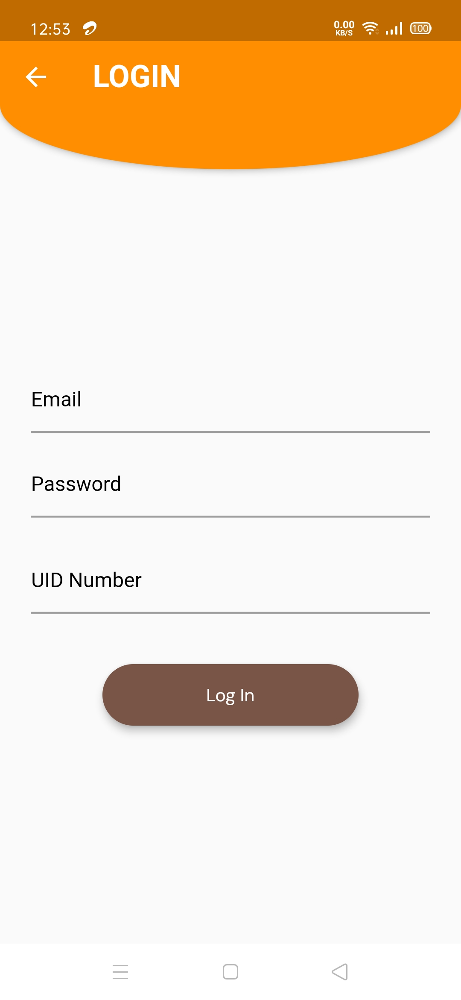
         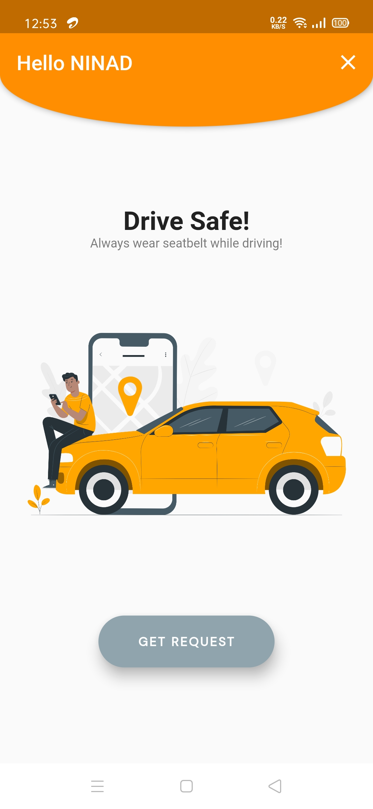         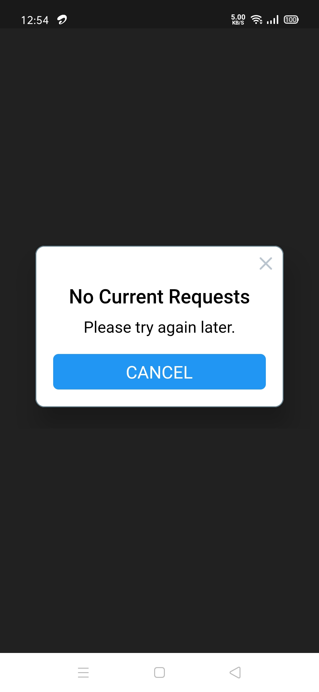
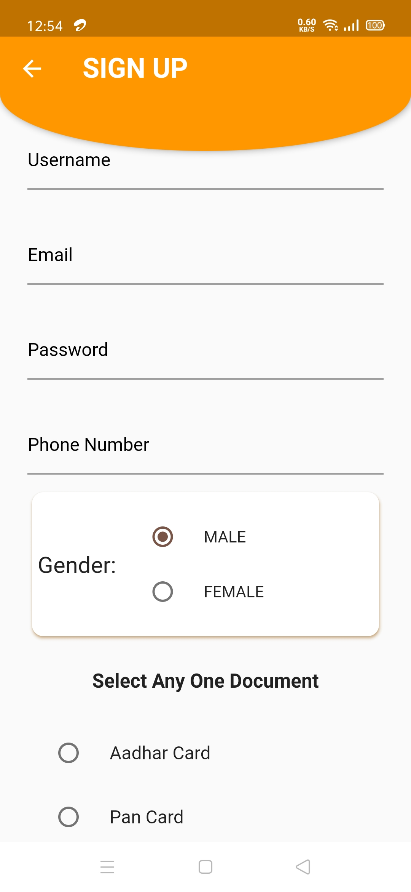        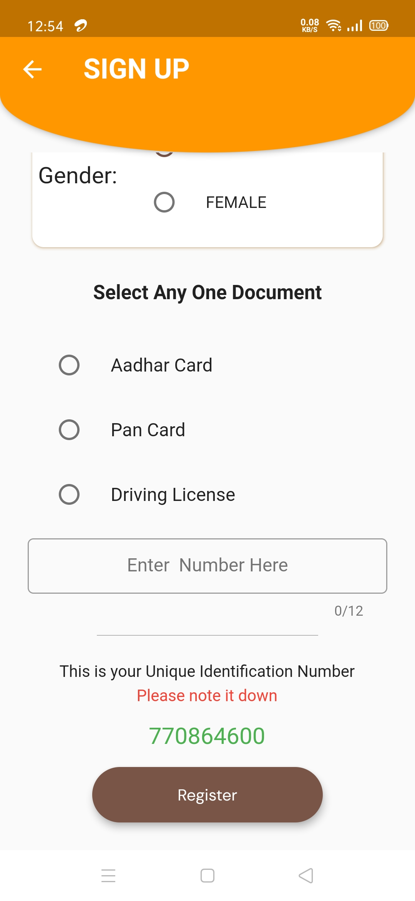
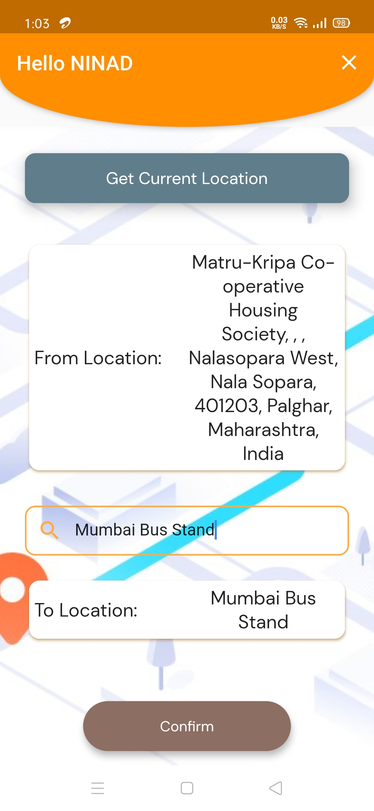       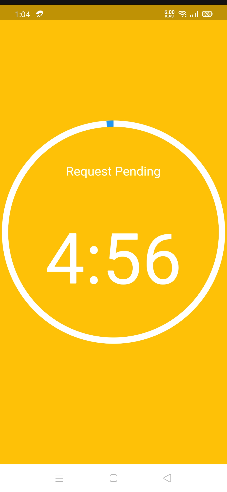
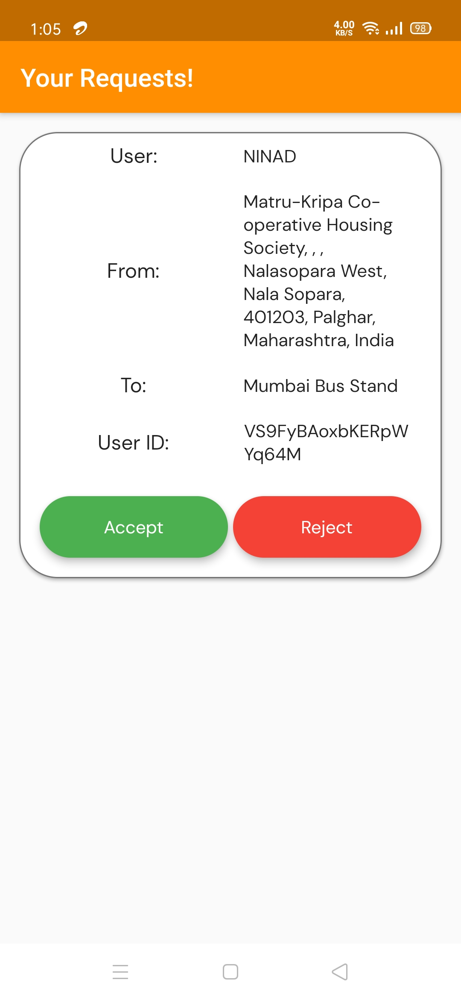        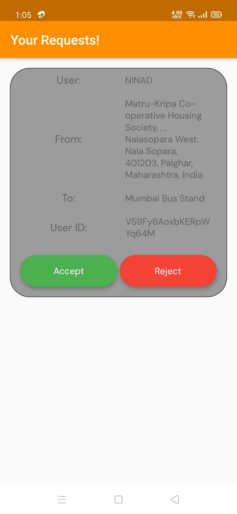
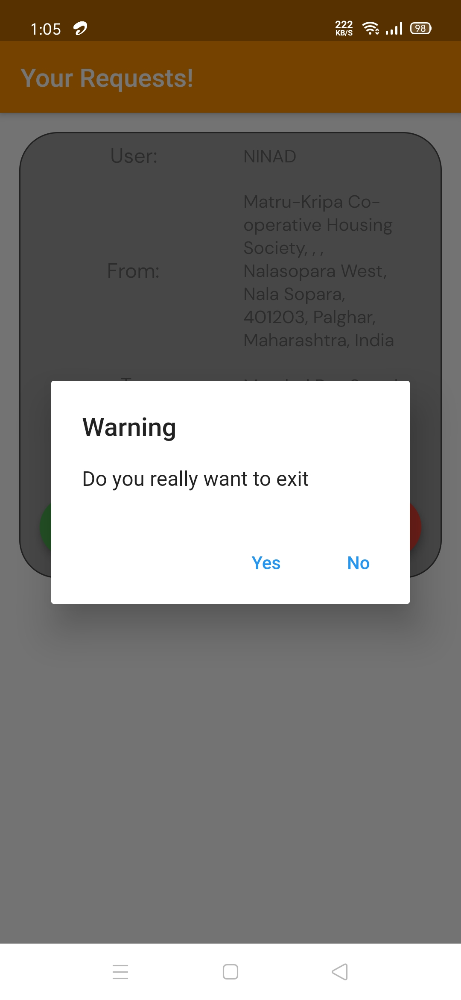
